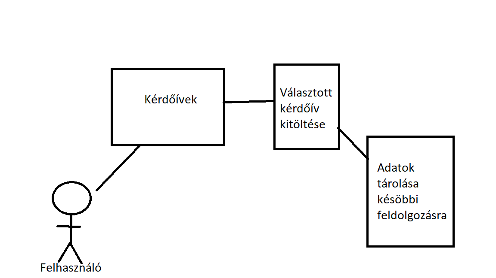
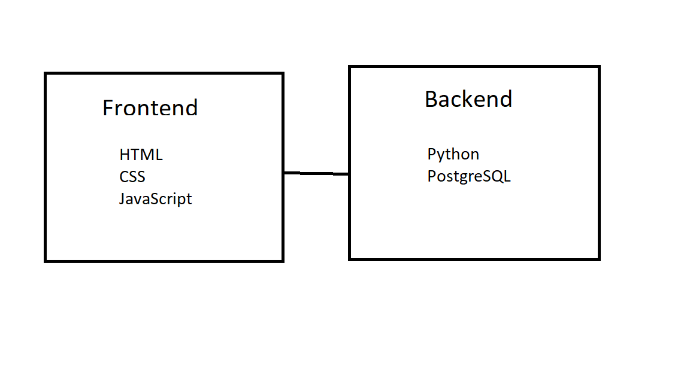

# Rendszerterv

## 1. A rendszer céljai:

Céljai:

    - A rendszer célja adat gyüjtés a felhasználó által létrehozott kérdőívre.

    - Használható több platformon is:

        - Asztali számítógépről

        - Laptopról

        - Okostelefonról

## 2. Projektterv:

A projekt egy web alkalmazás lesz ami adatbázist használ az adatok tárolására.

Backend munkák:

    - Demeter Benjámin

    - Kadarkuti Róbert

Frontend munkák:

    - Tercza Dávid

Ütemterv:

    - Fejlesztés: 2022. 11. 01-30

    - Tesztelés: 2022. 12. 01-05

    - Határidő: 2022. 12. 05.

## 3. Üzleti folymatok modellje:

## 4. Követelmények:

K01 Regisztráció

    - Felhasználó tudjon regisztrálni az oldalra.

K02 Bejelentkezés

    - Felhasználó betudjon jelentkezni a fiókjába.

K03 Kérdőív kiválasztása

    - Felhasználó tudjon böngészni a kérdőívek közt.

K04 Kérdőív kitöltése

    - Felhasználó kitudja tölteni a kiválasztott kérdőívet.

K05 Kérdőív létrehozása

    - Felhasználó tudjon létrehozni kérdőívet.

## 5. Funkcionális terv:
A rendszert használó különböző felhasználók:

    - Rendszergazda

    - Felhasználó

Rendszergazda:

    - Teljes hozzáférés a rendszerhez

Felhasználó:

    - Képes regisztrálni

    - Ha van fiókja betud lépni az oldalra

    - Képes kérdőíveket kitölteni:

        - kérdőív válaszok mentése
## 6. Fizikai könyezetek:

Az alkalmazás a könnyen hozzáférhetőség érdekében webre készül.

Az alkalmazás használ adatbázist is.

Fejlesztői környezetek:

    - Notepad++

    - Visual studio code

    - Pycharm

Tesztelési környezet:

    - Google Chrome

    - Microsoft Edge

    - Safari

    - Opera

    - Mozilla Firefox

## 7. Architekturális terv:

Az alkalmazás a böngészőben fog megjelleni ezért Frontend és Backendre bontjuk a fejlesztést.

A Backend fogja az adatbázist kezelni és a webszerver futását.

A Frontend fogja a felhasználóknak is értelmes olvasható formátumban megjeleníteni.

A Backend részhez szükséges:

    - Python

    - Adatbáziskezelő rendszer

A Frontend részhez szükséges:

    - HTML

    - CSS

    - JavaScript

## 8. Adatbázisterv:

## 9. Implementációs terv:

## 10. Tesztterv:

## 11. Telepítési terv:

A kérdőív egy webes alkalmazásként kerül megalkotásra így nem szükséges telepíteni semmilyen alkalmazást.

Maga a kérdőív egy webszerveren lesz elérhető, így a kliens oldalon mindössze ennyinek kell szerepelnie:

    - Egy böngésző amiben támogatott az adott weboldal elérése. (Google Chrome, Mozilla Firefox, Opera, stb.)

    - Webszerver eléréséhez internetkapcsolat szükségeltetik.

    - Elsősorban számítógépes környezet preferált, de reszponzív megoldás, telefonos megoldás működik.

## 12. Karbantartási terv:

Az alkalmazás ilyen esetekben igényel karbantartást:

    - Felhasználó által jelentett hiba esetén

    - További funkciók hozzáadása esetén

    - Böngészővel való kompatibilitás esetén

## 13. Fogalomtár: